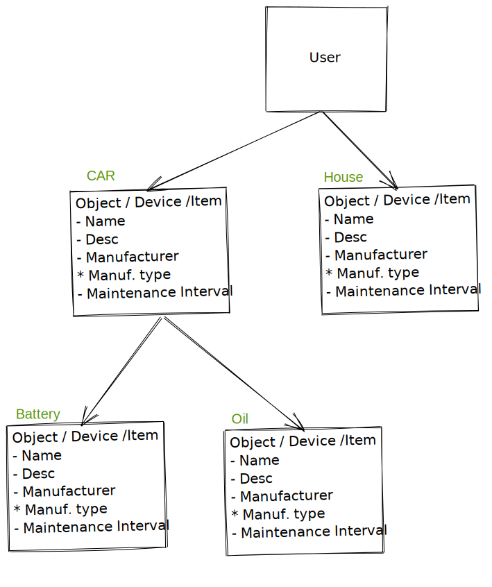

# Huoltokirja - Maintenance Book
Simple app for managing regular maintenance of the items.

## Design Document

User as root node which can create, read, update and delete child items.

## Design Goals

1. Learn and have fun
2. Try new things
3. TDD
4. Python type annotations

## Planned Features 

- Quick POC
- TUI
- Notifications
- Web UI (redwoodjs / Nextjs)
- Sensor integration
