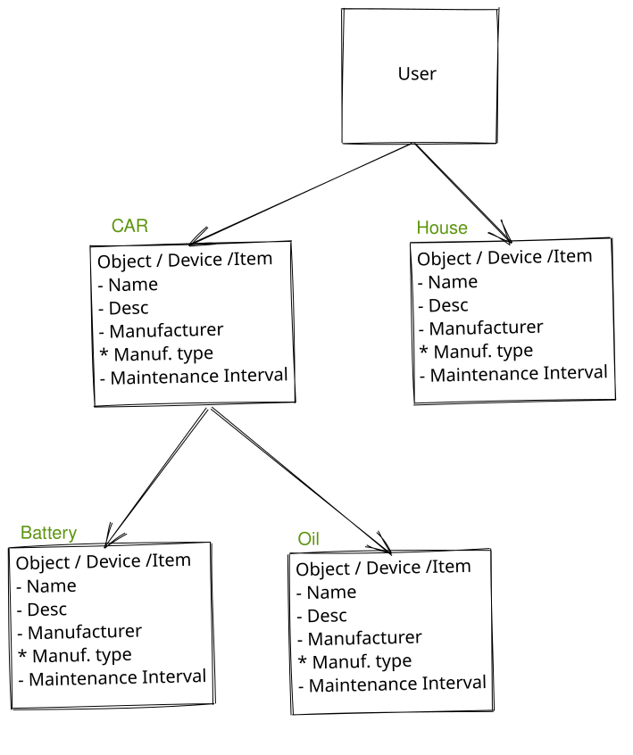

# Huoltokirja - Maintenance Book

A REST API application for tracking regular maintenance of items (cars, houses, bikes, etc.) with hierarchical item structure, document attachments, comments, and maintenance scheduling.

## Tech Stack

- **Backend:** FastAPI + SQLAlchemy 2.0 (async) + PostgreSQL 16
- **Frontend:** React
- **Migrations:** Alembic
- **Package manager:** uv
- **Containerization:** Docker + docker-compose

## Quick Start (Docker)

**Prerequisites:** Docker and Docker Compose installed.

```bash
# Start development server with hot reload
make dev
```

This builds and starts the API server and PostgreSQL database. The API is available at `http://localhost:8000`.

```bash
# Run database migrations
make migrate

# Populate with sample data (optional)
make populate
```

Data is stored in named Docker volumes and **persists across container restarts**:

- `postgres_data` — PostgreSQL database
- `uploads` — uploaded documents

To permanently delete all data, run `make clean`.

### Other Docker Commands

```bash
make up          # Start production server (detached)
make down        # Stop all containers
make test        # Run tests in Docker
make logs        # View logs
make shell       # Shell into app container
make db-shell    # Shell into database
make clean       # Remove containers, volumes, and all data
```

## Local Development (without Docker)

Requires Python 3.x, uv, and a running PostgreSQL instance.

```bash
make install          # Install dependencies (uv sync)
make run              # Start dev server on port 8000
make test-local       # Run tests
make lint             # Lint code
make populate-local   # Populate database with sample data
```

## Frontend

```bash
make frontend-install   # Install npm dependencies
make frontend-dev       # Start frontend dev server
make frontend-build     # Build for production
```

## API Endpoints

| Resource | Endpoints |
|---|---|
| Items | `GET/POST /api/v1/items`, `GET/PUT/DELETE /api/v1/items/{id}`, `POST /api/v1/items/{id}/children`, `GET /api/v1/items/due` |
| Maintenance | `POST/GET /api/v1/items/{id}/maintenance`, `PUT /api/v1/items/{id}/schedule` |
| Documents | `GET/POST /api/v1/items/{id}/documents`, `GET /api/v1/documents/{id}/download`, `DELETE /api/v1/documents/{id}` |
| Comments | `GET/POST /api/v1/items/{id}/comments`, `PUT/DELETE /api/v1/comments/{id}` |

## Design Document

User as root node which can create, read, update and delete child items.

